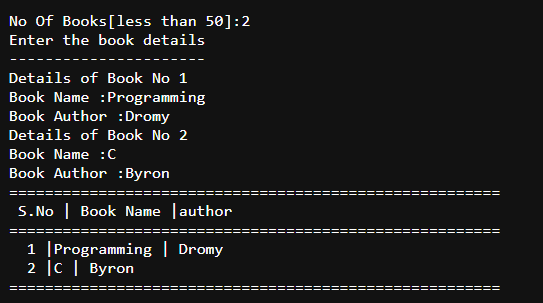

# Title: Books Details

## Coding Language: 
I coded this in C++

## Purpose: 
a) define a struct 'books' with fields name (string type and size 20) and author (string type and size 20)
b) declare an array a[50] of the above struct
c) input the number of books 
c) provide input specifications of the books 
d) print out the details of the books

## Here is a Live Demo:

## How to install:
1. Go to folder named: `code`
2. Downnload the code.
3. Make sure you have C++ sdk components install on your computer.
4. Or use a online compiler to run the code.

## Sample Output:

